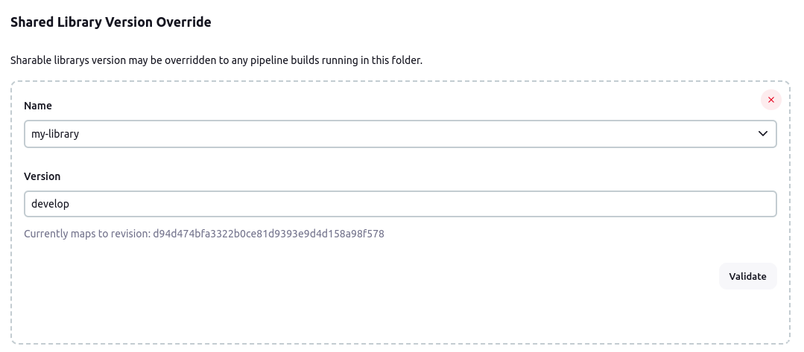

Shared Library Version Override plugin for Jenkins
===================================

## Overview

With this plugin, you can configure a specific version of a [Shared Library](https://www.jenkins.io/doc/book/pipeline/shared-libraries/) in folders.

## Setup

- Be sure you have [Pipeline Groovy Libraries](https://plugins.jenkins.io/pipeline-groovy-lib/) installed
- Go to the configuration page of your AbstractFolder
- Under The *Shared Library Version Override* section, add a new *Custom Configuration* element

## LICENSE

Licensed under MIT, see [LICENSE](LICENSE.md)

